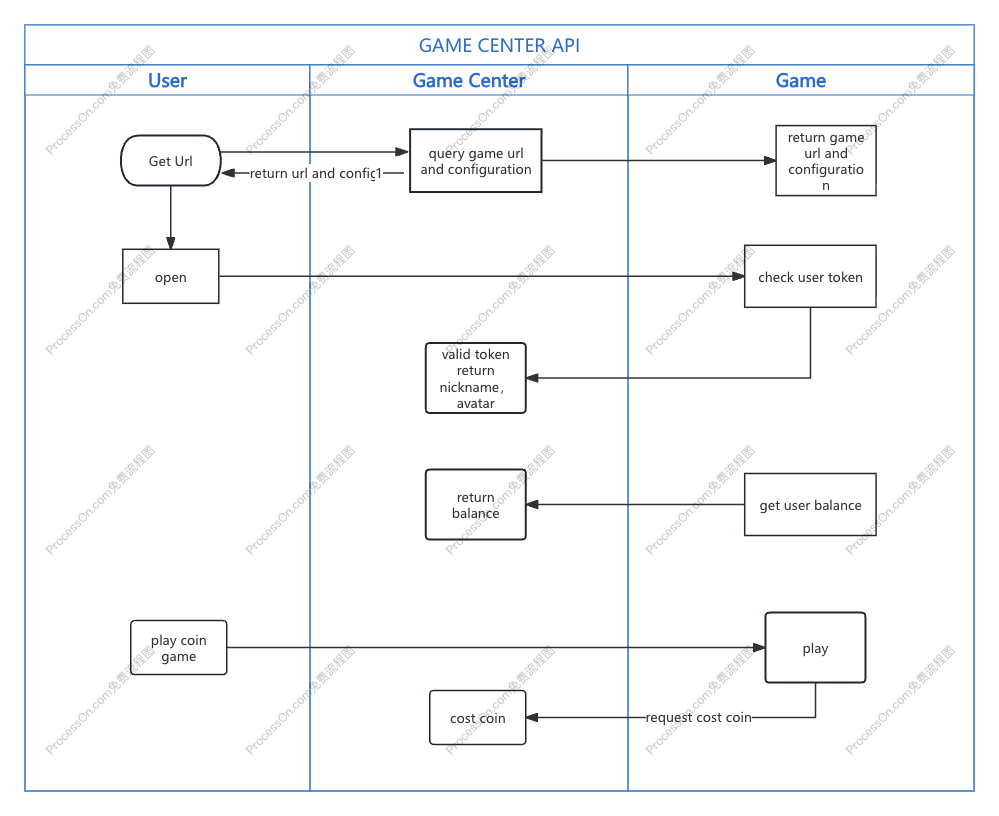

# 游戏中心（Game Center）接入指南

**适用对象：** 客户端研发、服务端研发、测试人员  
**更新日期：** 2026-03-04  
**文档版本：** V1.0.0

---

## 1. 前言

本文通过标准化接口，实现游戏端与游戏中心（Game Center，简称 GC）的交互。主要功能包括：

- 获取游戏链接
- 登录认证
- 用户信息、余额信息的获取
- 扣减积分
- 游戏记录查询

## 2. 交互时序图



## 3. 接入流程概览

1. **获取游戏链接**：Game Center 会通过游戏的 id 和用户登录 token 向游戏端 server 请求游戏链接地址。
2. **打开游戏与验证**：用户通过游戏链接打开游戏，游戏端 server 需向 Game Center 发起请求验证用户 token，并获取用户名和头像信息。
3. **获取余额**：游戏端 server 请求 Game Center 获取用户余额信息。
4. **积分操作**：用户玩积分游戏时，游戏服务端向 Game Center 发起扣分/加分请求。
5. **退出游戏**：用户退出游戏时，游戏服务端向 Game Center 发送游戏退出请求。

---

## 4. Game Center API 接口说明（Public Category）

### 4.1 User Token Validation（用户 Token 校验）

- **方法**：`POST`
- **路径**：`/game-proxy/user/token/check`

**Request Headers**

| 参数   | 说明 |
|--------|------|
| token  | 70d79fa3-e2f4-46ae-9b28-bbee4cd795b3（Token secret: game-proxy-10086） |

**Request Body**

```json
{
  "jsonrpc": "2.0",
  "id": "req-001",
  "method": "user.session.check",
  "params": {
    "token": "sdfsdfsdfsdfss"
  }
}
```

**Response Body**

```json
{
  "jsonrpc": "2.0",
  "id": "req-001",
  "method": "user.session.check",
  "result": {
    "a0": 100841,
    "userId": 100821,
    "avatar": "https:// pbtest.buyacard.cc/img/user/avatar/a.png",
    "nickname": "",
    "gender": 1
  },
  "error": null
}
```

（gender：0 未知 / 1 男 / 2 女）

---

### 4.2 User Score Change（用户积分变动）

- **方法**：`POST`
- **路径**：`/game-proxy/user/score/change`

**Request Headers**

| 参数   | 说明 |
|--------|------|
| token  | 70d79fa3-e2f4-46ae-9b28-bbee4cd795b3 |

**Request Body**

```json
{
  "jsonrpc": "2.0",
  "id": "req-001",
  "method": "user.score.change",
  "params": {
    "a0": 1008171,
    "userId": 1019818,
    "category": "0",
    "providerId": "1",
    "gameId": "181818",
    "score": 999.00,
    "transactionId": "23424324324",
    "opType": "debit",
    "currency": "RMB"
  }
}
```

（opType：debit / credit / return 取消退款）

**Response Body**

```json
{
  "jsonrpc": "2.0",
  "id": "req-001",
  "method": "user.score.change",
  "result": {
    "a0": 100841,
    "userId": 100821,
    "currency": "RMB",
    "score": "100.00"
  },
  "error": null
}
```

---

### 4.3 User Exit（用户退出）

- **方法**：`POST`
- **路径**：`/game-proxy/user/game/exit`

**Request Headers**

| 参数   | 说明 |
|--------|------|
| token  | 70d79fa3-e2f4-46ae-9b28-bbee4cd795b3 |

**Request Body**

```json
{
  "jsonrpc": "2.0",
  "id": "req-001",
  "method": "user.exit",
  "params": {
    "a0": 1008171,
    "userId": 1019818,
    "category": "0",
    "providerId": "1",
    "gameId": "181818"
  }
}
```

**Response Body**

```json
{
  "jsonrpc": "2.0",
  "id": "req-001",
  "method": "user.exit",
  "result": true,
  "error": null
}
```

---

### 4.4 Get User Balance（获取用户余额）

- **方法**：`POST`
- **路径**：`/game-proxy/user/balance`

**Request Headers**

| 参数   | 说明 |
|--------|------|
| token  | jwt |

**Request Body**

```json
{
  "jsonrpc": "2.0",
  "id": "req-001",
  "method": "user.balance",
  "params": {
    "a0": "1111111",
    "userId": 123123,
    "currency": "RMB"
  }
}
```

**Response Body**

```json
{
  "jsonrpc": "2.0",
  "id": "req-001",
  "method": "user.balance",
  "result": {
    "a0": 100841,
    "userId": 100821,
    "currency": "RMB",
    "score": "100.00"
  },
  "error": null
}
```

---

## 5. 游戏端提供的 API

以下接口由游戏端实现并对外提供，供 Game Center 调用。

### 5.1 Query Game Statistics Interface（游戏统计查询）

- **方法**：`POST`
- **路径**：`/game-proxy/game/order/stat`

**Request Body**

```json
{
  "jsonrpc": "2.0",
  "id": "req-001",
  "method": "game.order.stat",
  "params": {
    "a0": 19191,
    "userIds": [199817, 12123],
    "currency": "RNB",
    "isSettle": 0,
    "state": [],
    "gameInfo": { "category": "0", "providerId": "1", "gameId": "101891" },
    "groupId": "DEF",
    "beginTime": "YYYY-MM-DD HH:mm:ss",
    "endTime": "YYYY-MM-DD HH:mm:ss",
    "timezone": 0,
    "page": 1,
    "size": 100,
    "hasStat": 0
  }
}
```

**Response Body**

```json
{
  "jsonrpc": "2.0",
  "id": "req-001",
  "result": {
    "total": 100,
    "totalBetScore": 0,
    "totalSettleScore": 0,
    "totalValidScore": 0,
    "list": [
      {
        "gameId": "1",
        "groupId": "1",
        "currency": "RMB",
        "betScore": 100.0,
        "settleScore": 100.0,
        "validScore": 100.0,
        "userId": 100211
      }
    ]
  },
  "error": null
}
```

---

### 5.2 Query Game Order Interface（游戏订单查询）

- **方法**：`POST`
- **路径**：`/game-proxy/game/order/query`

**Request Headers**

| 参数   | 说明 |
|--------|------|
| token  | 70d79fa3-e2f4-46ae-9b28-bbee4cd795b3 |

**Request Body**

```json
{
  "jsonrpc": "2.0",
  "id": "req-001",
  "method": "game.order.query",
  "params": {
    "orderId": "1213123213",
    "a0": 19191,
    "userId": 199817,
    "currency": "RNB",
    "state": [0],
    "gameInfo": { "category": "0", "providerId": "1", "gameId": "101891" },
    "returnGameInfo": 0,
    "groupId": "sdfs",
    "beginTime": "YYYY-MM-DD HH:mm:ss",
    "endTime": "YYYY-MM-DD HH:mm:ss",
    "timeZone": 0,
    "page": 1,
    "size": 100,
    "hasStat": 0
  }
}
```

**Response Body**

```json
{
  "jsonrpc": "2.0",
  "id": "req-001",
  "result": {
    "total": 100,
    "totalBetScore": 0,
    "totalSettleScore": 0,
    "totalValidScore": 0,
    "list": [
      {
        "a0": "12313",
        "userId": "324324",
        "gameId": "1",
        "orderId": "2342342",
        "currency": "RMB",
        "betTime": "YYYY-MM-DD HH:mm:ss",
        "state": 1,
        "betScore": 100.0,
        "settleScore": 100.0,
        "validScore": 100.0,
        "settleTime": "YYYY-MM-DD HH:mm:ss",
        "groupId": "2322",
        "isSettle": 0,
        "gameInfo": {}
      }
    ]
  },
  "error": null
}
```

（state：0 未结算 / 1 赢 / 2 和 / 3 输 / 4 用户取消 / 5 系统取消 / 7 异常）

---

### 5.3 Query Order Detail Interface（订单详情查询）

- **方法**：`POST`
- **路径**：`/game-proxy/game/order/detail`

**Request Headers**

| 参数   | 说明 |
|--------|------|
| token  | 70d79fa3-e2f4-46ae-9b28-bbee4cd795b3 |

**Request Body**

```json
{
  "jsonrpc": "2.0",
  "id": "req-001",
  "method": "game.order.detail",
  "params": {
    "orderId": "1213123213",
    "language": "CN",
    "currency": "CNY",
    "gameInfo": { "category": "0", "providerId": "1", "gameId": "101891" }
  }
}
```

**Response Body**

```json
{
  "jsonrpc": "2.0",
  "id": "req-001",
  "result": "https://sfdsfd.com",
  "error": null
}
```

---

### 5.4 Get Game URL（获取游戏链接）

- **方法**：`POST`
- **路径**：`/game-proxy/game/url`

**Request Headers**

| 参数         | 说明 |
|--------------|------|
| Content-Type | application/json |
| token        | 70d79fa3-e2f4-46ae-9b28-bbee4cd795b3（生成方式见：https://pb-api-doc.pwtk.cc/project/253/wiki） |

**Request Body**

```json
{
  "jsonrpc": "2.0",
  "id": "req-001",
  "method": "game.url",
  "params": {
    "token": "sdfdsfdsfsd",
    "device": "PC",
    "language": "CN",
    "currency": "RNB",
    "groupId": "1000",
    "isGroupTrace": 0,
    "isDemo": 0,
    "gameInfo": { "category": "0", "providerId": "1", "gameId": "101891" },
    "returnUrl": ""
  }
}
```

**Response Body**

```json
{
  "jsonrpc": "2.0",
  "id": "req-001",
  "result": {
    "url": "https://www.ddf.com",
    "config": {}
  },
  "error": null
}
```

---

### 5.5 Order Collection Interface（订单汇总接口）

- **方法**：`POST`
- **路径**：`/game-proxy/game/order/collect`

**Request Headers**

| 参数         | 说明 |
|--------------|------|
| Content-Type | application/json |

**Request Body**

请求格式为 JSON-RPC，参数包括：startTime、endTime、pageNum、pageSize、providerId、categoryId、gameId、timeZone（0 北京时间 / 1 美东时间）等。

**Response Body**

分页数据，字段包括：a0、userId、providerId、categoryId、gameId、groupId、orderId、betScore、effectScore、settleScore、status、betTime、settleTime、gameInfo、currency 等。

---

### 5.6 Exit Game（退出游戏）

- **方法**：`POST`
- **路径**：`/game-proxy/game/exit`

**Request Headers**

| 参数   | 说明 |
|--------|------|
| token  | 70d79fa3-e2f4-46ae-9b28-bbee4cd795b3 |

**Request Body**

```json
{
  "jsonrpc": "2.0",
  "id": "req-001",
  "method": "game.user.exit",
  "params": {
    "a0": 19191,
    "userId": 199817,
    "device": "PC",
    "language": "CN",
    "currency": "RNB",
    "groupId": "were",
    "gameInfo": { "category": "0", "providerId": "1", "gameId": "101891" }
  }
}
```

**Response Body**

```json
{
  "jsonrpc": "2.0",
  "id": "req-001",
  "result": true,
  "error": null
}
```

---

## 6. 请求鉴定权：通过 JWT Token 的方式

接口请求需在请求头中携带 JWT Token 进行身份鉴定。调用方需在 **Request Headers** 中增加 `token` 字段，取值为有效的 JWT Token。服务端将校验该 Token 的合法性与有效性，校验通过后方可访问对应接口。

### Token 生成 Demo

```java
public String getToken() {
    Map<String, String> map = new HashMap<>(2);
    map.put("service", "game-center");
    map.put("exp", System.currentTimeMillis() + 24 * 3600 * 1000L + "");
    // map.put("iat", System.currentTimeMillis() + "");
    return JWTUtil.generateToken(key, System.currentTimeMillis() + 24 * 3600 * 1000L, map);
}
```

